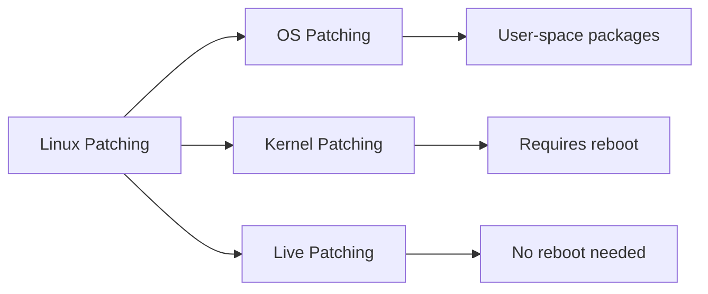

# 🔧 Linux Patching & Kubernetes Service Patching Guide

> **Production-ready strategies for OS, Kernel, and K8s node patching in enterprise environments**

[](https://www.linux.org/)
[](https://kubernetes.io/)
[](https://opensource.org/licenses/MIT)

---

## 📋 Table of Contents

- [Overview](#-overview)
- [Linux Patching Fundamentals](#-linux-patching-fundamentals)
- [Pre-Patching Checklist](#-pre-patching-checklist)
- [OS Package Patching](#-os-package-patching)
- [Kernel Patching](#-kernel-patching)
- [Live Kernel Patching](#-live-kernel-patching)
- [Kubernetes Service Patching](#-kubernetes-service-patching)
- [Rollback Strategies](#-rollback-strategies)
- [Automation Examples](#-automation-examples)
- [Production Best Practices](#-production-best-practices)
- [Interview Q&A](#-interview-qa)

---

## 🎯 Overview

This repository provides battle-tested Linux patching procedures for:

- **Enterprise Linux environments** (RHEL, Ubuntu, CentOS, Rocky, Alma)
- **Kubernetes clusters** (AKS, EKS, GKE, self-managed)
- **DevOps/SRE workflows** with zero-downtime strategies

### Why Patch?

| Reason | Impact |
|--------|--------|
| 🔒 **Security** | Fix CVEs and vulnerabilities |
| 🐛 **Stability** | Resolve bugs and crashes |
| ⚡ **Performance** | Optimize system efficiency |
| 📜 **Compliance** | Meet ISO, SOC2, PCI-DSS, CIS standards |

---

## 🛠️ Linux Patching Fundamentals

### Patching Types



| Type | What Gets Updated | Reboot Required? |
|------|-------------------|------------------|
| **OS Patching** | openssl, glibc, sudo, systemd | Usually No |
| **Kernel Patching** | Linux kernel core | Yes |
| **Live Patching** | Kernel via kpatch/Livepatch | No |

### Enterprise Workflow

```
📊 Assess → 📝 Plan → 💾 Backup → 🔧 Patch → 🔄 Reboot → ✅ Validate → 📈 Report
```

---

## ✅ Pre-Patching Checklist

**CRITICAL**: Never patch production without these checks!

```bash
# 1. Identify OS & Kernel version
cat /etc/os-release
uname -r

# 2. Check system uptime
uptime

# 3. List running services
systemctl list-units --type=service --state=running

# 4. Verify disk space (need at least 20% free)
df -h

# 5. Document current state
rpm -qa > /tmp/packages-before.txt  # RHEL-based
dpkg -l > /tmp/packages-before.txt  # Debian-based
```

### Backup Strategies

| Environment | Backup Method |
|-------------|---------------|
| **Cloud VMs** | VM snapshot (AWS/Azure/GCP) |
| **Bare Metal** | LVM snapshot |
| **Databases** | `pg_dump` / `mysqldump` |
| **Containers** | Image versioning |

---

## 📦 OS Package Patching

### RHEL / CentOS / Rocky / Alma

```bash
# Check available updates
sudo yum check-update

# Update all packages
sudo yum update -y

# Security updates only
sudo yum update --security -y

# Verify updates
rpm -qa --last | head -20
```

### Ubuntu / Debian

```bash
# Refresh package lists
sudo apt update

# Upgrade all packages
sudo apt upgrade -y

# Security updates only
sudo unattended-upgrade

# Verify updates
grep "upgrade" /var/log/apt/history.log
```

---

## 🔩 Kernel Patching

### Traditional Method (Requires Reboot)

#### Check Current Kernel

```bash
# Display running kernel
uname -r

# List installed kernels
rpm -qa kernel           # RHEL-based
dpkg -l | grep linux-image  # Ubuntu
```

#### Update Kernel

**RHEL Family:**
```bash
sudo yum update kernel -y
```

**Ubuntu:**
```bash
sudo apt install linux-image-generic -y
```

#### Reboot and Verify

```bash
# Schedule reboot
sudo reboot

# After reboot, verify
uname -r
```

### Kernel Rollback via GRUB

```bash
# Set default kernel (if new kernel fails)
grubby --set-default /boot/vmlinuz-<old-version>

# Or select at boot:
# Advanced options → Select previous kernel
```

---

## ⚡ Live Kernel Patching

**Use Case**: High-availability systems where reboots are costly

### Available Tools

| Tool | OS Support | Provider |
|------|-----------|----------|
| **kpatch** | RHEL / CentOS | Red Hat |
| **Ksplice** | Oracle Linux | Oracle |
| **Livepatch** | Ubuntu | Canonical |
| **Azure Live Patch** | Azure Linux | Microsoft |

### Example: kpatch on RHEL

```bash
# Install kpatch
yum install kpatch -y

# Enable service
systemctl enable kpatch

# List active patches
kpatch list

# View patch info
kpatch info
```

> ⚠️ **Important**: Live patching does NOT eliminate the need for reboots. Schedule periodic reboots quarterly.

---

## ☸️ Kubernetes Service Patching

### The Golden Rule

**Never patch a node while serving workloads!**

```
Cordon → Drain → Patch → Reboot → Uncordon
```

### Linux Services on K8s Nodes

| Category | Examples |
|----------|----------|
| **OS Services** | `sshd`, `cron`, `rsyslog` |
| **Container Runtime** | `containerd`, `docker` |
| **K8s Services** | `kubelet`, `kube-proxy` |
| **Networking** | CNI plugins (Calico, Cilium) |

---

## 🔄 Manual Node Patching (Step-by-Step)

### Step 1: Cordon Node

```bash
# Prevent new pods from scheduling
kubectl cordon node-1
```

### Step 2: Drain Node

```bash
# Safely evict pods
kubectl drain node-1 \
  --ignore-daemonsets \
  --delete-emptydir-data \
  --force
```

**What happens:**
- Pods reschedule to healthy nodes
- StatefulSets respect PodDisruptionBudgets
- DaemonSets remain (required system pods)

### Step 3: Patch the Node

```bash
# SSH into node
ssh node-1

# Update packages
sudo yum update -y  # or apt upgrade -y

# Restart services if needed
sudo systemctl restart containerd
sudo systemctl restart kubelet
```

### Step 4: Reboot (if kernel updated)

```bash
sudo reboot
```

### Step 5: Verify Node Health

```bash
# Wait for node to become Ready
kubectl get nodes -w

# Expected output:
# NAME     STATUS   ROLES    AGE   VERSION
# node-1   Ready    worker   10d   v1.28.0
```

### Step 6: Uncordon Node

```bash
# Allow pod scheduling again
kubectl uncordon node-1
```

---

## 🚀 Managed Kubernetes Patching

### Azure Kubernetes Service (AKS)

```bash
# Upgrade node pool (recommended approach)
az aks nodepool upgrade \
  --resource-group my-rg \
  --cluster-name prod-cluster \
  --name nodepool1 \
  --kubernetes-version 1.28.0
```

**What AKS does automatically:**
1. Cordons old node
2. Drains workloads
3. Creates new patched node
4. Deletes old node

### Amazon EKS

```bash
# Upgrade managed node group
eksctl upgrade nodegroup \
  --cluster prod-cluster \
  --name ng-workers \
  --kubernetes-version 1.28
```

### Google GKE

```bash
# Enable auto-upgrade
gcloud container node-pools update pool-1 \
  --cluster prod-cluster \
  --enable-autoupgrade
```

---

## 🛡️ PodDisruptionBudget (Critical!)

**Always define PDBs for production workloads:**

```yaml
apiVersion: policy/v1
kind: PodDisruptionBudget
metadata:
  name: backend-pdb
spec:
  minAvailable: 2  # Keep at least 2 pods running
  selector:
    matchLabels:
      app: backend
```

This prevents:
- Complete service outage during drains
- Violating SLA during maintenance

---

## 🔙 Rollback Strategies

### VM Snapshot Rollback

**AWS:**
```bash
aws ec2 create-snapshot --volume-id vol-xxxxx
```

**Azure:**
```bash
az vm snapshot create --name backup-snapshot \
  --resource-group my-rg \
  --source vm-id
```

### Kernel Rollback

```bash
# List installed kernels
grubby --info=ALL

# Set old kernel as default
grubby --set-default /boot/vmlinuz-<old-version>

# Reboot
reboot
```

---

## 🤖 Automation Examples

### Ansible Playbook

```yaml
---
- name: Patch Linux Servers
  hosts: linux_servers
  become: yes
  tasks:
    - name: Update all packages (RHEL)
      yum:
        name: "*"
        state: latest
      when: ansible_os_family == "RedHat"

    - name: Update all packages (Ubuntu)
      apt:
        upgrade: dist
        update_cache: yes
      when: ansible_os_family == "Debian"

    - name: Reboot if kernel updated
      reboot:
        reboot_timeout: 600
      when: kernel_updated
```

### Cron Job (Non-Production)

```bash
# /etc/crontab
# Auto-patch every Sunday at 2 AM
0 2 * * 0 root yum update -y && reboot
```

### Azure Update Manager

```bash
# Create maintenance configuration
az maintenance configuration create \
  --resource-group my-rg \
  --name monthly-patching \
  --maintenance-scope OSImage \
  --start-date-time "2024-01-15 02:00" \
  --duration "04:00" \
  --recur-every "Month Third Sunday"
```

---

## ✨ Production Best Practices

| Practice | Why It Matters |
|----------|----------------|
| **🎯 Test in Dev First** | Catch issues before prod |
| **📅 Maintenance Windows** | Patch during low-traffic hours |
| **🔄 Canary Deployments** | Patch 1-2 nodes first, monitor |
| **📊 Monitor Post-Patch** | Watch metrics for 24-48 hours |
| **📝 Document Everything** | Runbooks save time in incidents |
| **🔐 Backup Before Patch** | Always have rollback ready |

### Recommended Patching Frequency

| Component | Frequency | Reboot? |
|-----------|-----------|---------|
| **OS Packages** | Monthly | Rarely |
| **Kernel** | Quarterly | Yes |
| **Container Images** | Every release | No |
| **K8s Cluster** | Every 3-6 months | No |

---

## 💬 Interview Q&A

### Q1: What's the difference between OS and kernel patching?

**Answer**: OS patching updates user-space packages (openssl, glibc, sudo) and rarely requires a reboot. Kernel patching updates the Linux kernel itself and requires a reboot because the kernel loads into memory only at boot time.

---

### Q2: Why does kernel patching require a reboot?

**Answer**: The Linux kernel is loaded into memory during system boot and manages all hardware and processes. Since it's not a regular service that can be restarted, the only way to load a new kernel version is to reboot the system.

---

### Q3: Can you patch a kernel without rebooting?

**Answer**: Yes, using live patching technologies like kpatch (RHEL), Ksplice (Oracle Linux), or Canonical Livepatch (Ubuntu). However, live patching should not replace regular reboots—systems should still be rebooted periodically for full updates.

---

### Q4: How do you safely patch Kubernetes nodes?

**Answer**: Use the cordon-drain-patch-reboot-uncordon workflow. Cordon prevents new pods, drain moves existing pods safely, then patch and reboot the node, verify it's healthy, and uncordon to allow scheduling again. This ensures zero downtime when combined with PodDisruptionBudgets.

---

### Q5: What happens if you don't drain before patching?

**Answer**: Pods will experience abrupt termination during reboot, causing downtime for stateless apps and potential data loss for stateful workloads. This violates SLAs and can cause incidents.

---

### Q6: What is a PodDisruptionBudget?

**Answer**: A PDB defines the minimum number of pods that must remain available during voluntary disruptions like node drains. For example, `minAvailable: 2` ensures at least 2 pods stay running, preventing complete service outage.

---

## 🤝 Contributing

Contributions are welcome! Please:

1. Fork this repository
2. Create a feature branch (`git checkout -b feature/amazing-addition`)
3. Commit your changes (`git commit -m 'Add amazing patching tip'`)
4. Push to the branch (`git push origin feature/amazing-addition`)
5. Open a Pull Request

---

## 📄 License

This project is licensed under the MIT License - see the [LICENSE](LICENSE) file for details.

---

## 🙏 Acknowledgments

- Red Hat Enterprise Linux documentation
- Kubernetes official docs
- Cloud provider best practices (AWS, Azure, GCP)
- SRE community wisdom

---

## 📧 Contact

For questions or suggestions:

- Open an issue in this repository
- Reach out on [LinkedIn](#)
- Email: devops@yourcompany.com

---

<div align="center">

**⭐ Star this repo if you found it helpful!**

Made with ❤️ by DevOps Engineers, for DevOps Engineers

</div>
